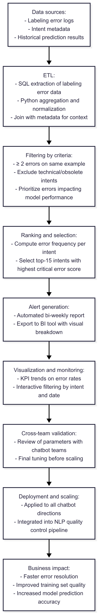
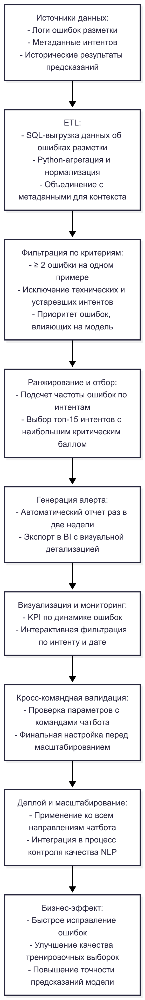

# Automatic Alert for Incorrect Auto-Labeling in Chatbot Intents

---

## 🇬🇧 English version

**Timeline:** Q1 2024 — Present
**Role:** ML/NLP Engineer
**Tech stack:** Python • pandas • SQL • ETL • BI tools

### Context

Frequent auto-labeling errors in chatbot intents reduced intent accuracy, introduced noise into training datasets, and decreased trust in automation results. Manual detection was time-consuming and incomplete, slowing down systematic quality improvements.

### Goal

Develop an **automated alert** to:

* Detect the **top-15 intents** with the most critical auto-labeling errors.
* Prioritize examples requiring description or formulation corrections.
* Enable quick response to quality issues, improving prediction accuracy.

### Approach

**Data Pipeline**

* **SQL** script to extract labeling error data.
* **Python** for aggregation, filtering, and ranking by error frequency and significance.
* Filtering criteria:

  * ≥ 2 errors on the same example.
  * Exclusion of technical/obsolete categories.
  * Prioritization of errors affecting model performance.

**Alert System**

* Automated report generated **bi-weekly**.
* Displays **top-15 problem intents** with highest correction priority.
* Integrated into BI tools for visual analysis.

**Cross-Team Integration**

* Filtering parameters selected collaboratively with each chatbot direction team.
* Scaled to all chatbot directions and transferred to the NLP team.

### Results

* **>20x reduction** in per-example errors.
* Increased accuracy on Elastic nodes, especially in high-frequency areas.
* **1.5+ years** of stable production use.
* Became part of the overall model quality control process.

### Business Impact

* Improved data quality in training sets.
* Reduced time to detect and fix critical errors.
* Increased stability of business logic and query understanding.
* Delivered a scalable, explainable, and ML-light algorithm with measurable accuracy impact.

### Key Skills Highlighted for ML/NLP Engineer

* Automated data quality control for ML/NLP.
* ETL for error analysis in text datasets.
* Cross-team integration of analytical solutions.
* Development of explainable ranking algorithms for model improvement.

### Pipeline

---

## 🇷🇺 Русский вариант

**Timeline:** Q1 2024 — по настоящее время
**Роль:** ML/NLP инженер
**Технологии:** Python • pandas • SQL • ETL • BI инструменты

### Контекст

Частые ошибки авторазметки в интентах чатбота снижали их точность, вносили шум в тренировочные данные и уменьшали доверие к результатам автоматизации. Ручной поиск занимал много времени и был неполным, что мешало системному улучшению качества.

### Цель

Разработать **автоматический алерт**, который:

* Выявляет **топ-15 интентов** с наибольшим числом критичных ошибок авторазметки.
* Фокусируется на примерах, требующих доработки описаний и формулировок.
* Позволяет быстро реагировать на проблемы и повышать точность предсказаний.

### Подход

**Data Pipeline**

* **SQL**-скрипт для получения данных об ошибках разметки.
* **Python** для агрегации, фильтрации и ранжирования по частоте и значимости ошибок.
* Критерии фильтрации:

  * ≥ 2 ошибки на одном примере.
  * Исключение технических и устаревших категорий.
  * Приоритет ошибок, влияющих на работу модели.

**Система алертов**

* Автоматическая генерация отчета **раз в две недели**.
* Выводит **топ-15 проблемных интентов** с наибольшим приоритетом исправления.
* Интеграция с BI-инструментами для визуального анализа.

**Кросс-командная интеграция**

* Параметры фильтрации подбирались совместно с командами всех направлений чатбота.
* Решение масштабировано на все направления и передано команде NLP.

### Результаты

* **>20x снижение** количества ошибок на одном примере.
* Рост точности на нодах Elastic, особенно в частотных зонах.
* **1.5+ года** стабильной работы в продакшене.
* Стало частью общего процесса контроля качества моделей.

### Бизнес-эффект

* Повышено качество данных в тренировочных выборках.
* Сокращено время поиска и исправления критичных ошибок.
* Повышена устойчивость бизнес-логики и понимания запросов пользователей.
* Создан масштабируемый, объяснимый и несложный алгоритм с прямым влиянием на точность моделей.

### Ключевые навыки ML/NLP инженера

* Автоматизация контроля качества данных для ML/NLP.
* ETL-процессы для анализа ошибок в текстовых данных.
* Кросс-командная интеграция аналитических решений.
* Разработка объяснимых алгоритмов ранжирования для улучшения моделей.

### Пайплайн

