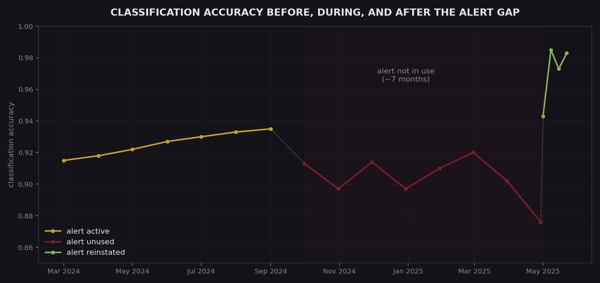
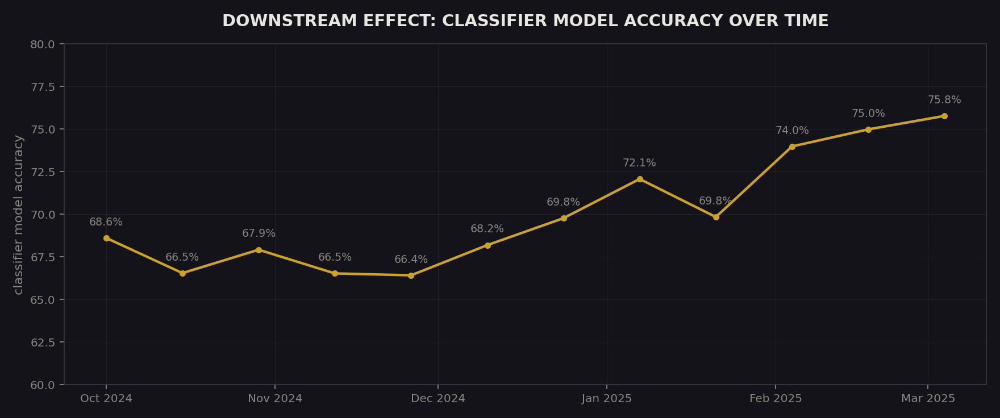
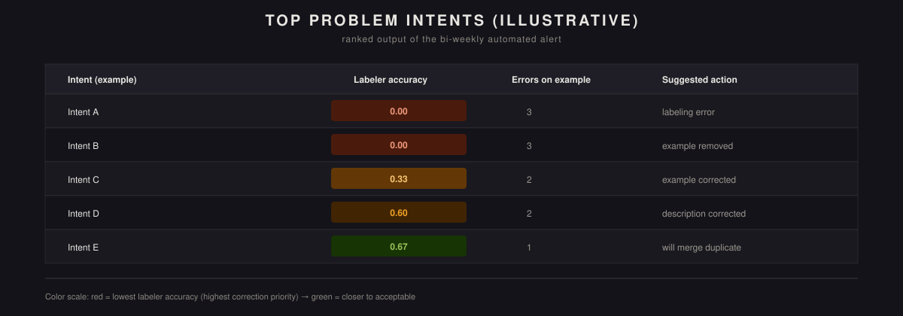

  

<a href="README.md">English version →</a>

# Автоматический алерт по ошибкам авторазметки интентов чат-бота

> **О коде.** Этот репозиторий описывает методологию, ключевые решения и результаты. Реализация является собственностью компании, в которой создавался проект, и не публикуется.

Простой, полностью объяснимый алгоритм ранжирования, который раз в две недели выявляет 15 интентов чат-бота с наиболее критичными ошибками авторазметки — и, что необычно для подобного проекта, сопровождается прямым доказательством "до/после" того, что он реально имел значение.

## Сначала — доказательство

График выше — не иллюстрация для наглядности, а то, что произошло на самом деле, когда команда перестала использовать этот алерт примерно на семь месяцев, а затем вернула его. Пока алерт работал, точность классификации стабильно росла (≈91.5% → ≈93.5%). Как только его перестали использовать, точность за последующие месяцы просела до ≈87.6% — относительное снижение примерно на 6%. В течение нескольких недель после возврата алерта точность поднялась выше 98% — относительное восстановление более чем на 12% от нижней точки. Это не был спланированный причинный эксперимент с контрольной группой, но совпадение по времени достаточно чёткое, чтобы считать это сильным, пусть и неформальным, доказательством того, что алерт делал реальную работу, а не просто генерировал отчёты, которые никто не использовал.

**Влияние на модель ниже по пайплайну.** Сама модель-классификатор обучается на размеченных примерах, проходящих через этот full-text слой, поэтому более чистая разметка на входе в теории должна поднимать и точность самой модели со временем. На практике так и происходит — точность стабильно росла с ≈68.6% до пика ≈75.8% на протяжении нескольких месяцев. (Позже метрика снизилась по несвязанной причине — переобучение модели, — поэтому этот участок здесь намеренно не показан, чтобы не смешивать два разных эффекта.)

  

## Проблема

Ошибки авторазметки в интентах чат-бота встречались достаточно часто, чтобы заметно снижать точность интентов, вносить шум в тренировочные датасеты и подрывать доверие к автоматизации в целом. Ручное выявление таких ошибок было медленным и неполным, из-за чего системное улучшение качества постоянно буксовало.

## Подход

**Пайплайн данных.** SQL-скрипт выгружает данные об ошибках разметки; Python агрегирует, фильтрует и ранжирует их по частоте и значимости. Правила фильтрации намеренно простые и объяснимые: не менее 2 ошибок на одном gold-примере, исключение технических или устаревших категорий, приоритет ошибкам, реально влияющим на работу модели, а не краевым случаям.

**Система алертов.** Отчёт генерируется автоматически раз в две недели, выводя топ-15 проблемных интентов, ранжированных по приоритету исправления, и передаётся в BI-инструменты команды для визуального разбора. Иллюстративный пример ниже показывает форму этого отчёта — точность по каждому примеру, окрашенная по степени критичности, вместе с рекомендованным корректирующим действием:

  

**Почему точность на этом этапе так важна.** Один из входов, за которым следит этот алерт — full-text слой сопоставления, ранняя, дешёвая ступень классификации интентов, задача которой — дёшево ловить сообщения до того, как потребуются более тяжёлые и дорогие методы дальше по пайплайну. Поскольку всё, что идёт после, зависит от точности этого сопоставления, даже небольшие ошибки разметки здесь заметно накапливаются к более поздним этапам.

**Кросс-командная интеграция.** Параметры фильтрации согласовывались совместно с каждой продуктовой командой чат-бота, а не задавались единолично, после чего решение масштабировали на все направления чат-бота и передали команде NLP для дальнейшего сопровождения.

## Результаты

- Снижение количества ошибок на одном размеченном примере более чем в 20 раз.
- Стабильная работа в проде более 1.5 лет (как минимум с 2024 года) — достаточно долго, чтобы увидеть то самое естественное сравнение "до/после" выше.
- Стал стандартной частью более широкого процесса контроля качества моделей, а не разовым отчётом.

## Влияние на бизнес

- Повышено качество тренировочных данных за счёт отлова ошибок разметки до того, как они накопятся на более поздних этапах.
- Сокращено время на поиск и исправление критичных ошибок вместо неполного ручного процесса.
- Повышена устойчивость базовой бизнес-логики и понимания запросов — график точности выше служит прямым доказательством того, что происходит, если оставить эту устойчивость без контроля.
- Создан масштабируемый, полностью объяснимый алгоритм — достаточно простой, чтобы каждый участник понимал, почему именно этот интент попал в список, с измеримой связью с точностью модели.

## Технологии

Python · pandas · SQL · ETL · BI-инструменты отчётности

---

Индивидуальный проект в рамках роли Data Analytics. Описан здесь в портфолио-целях; продовый код не публикуется.
